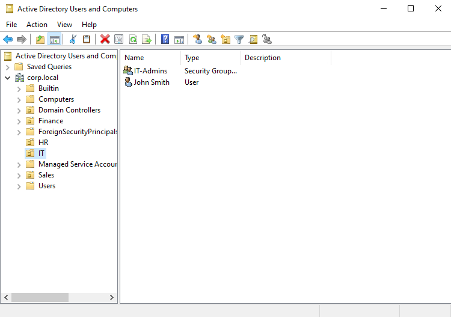
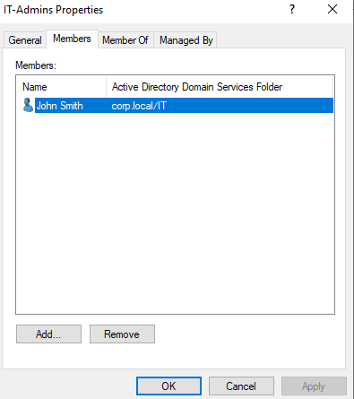
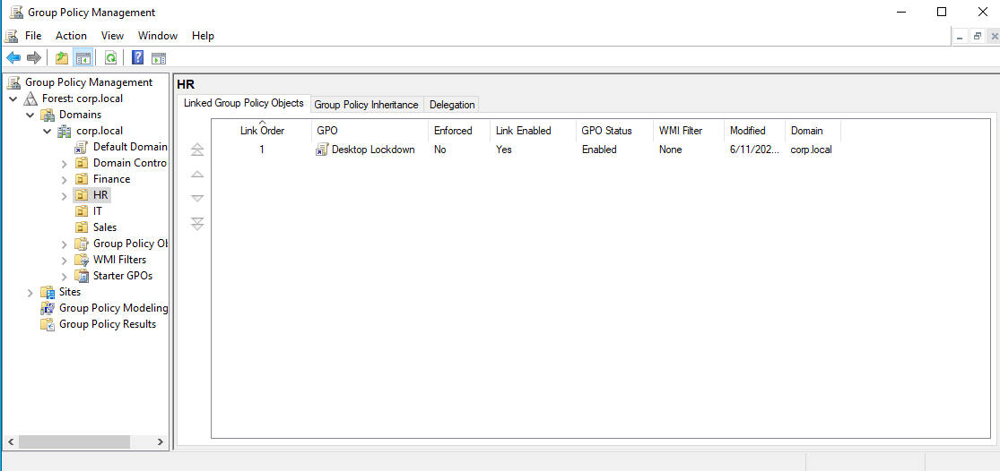
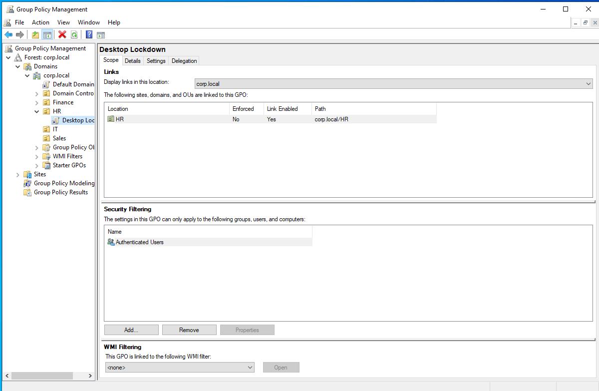
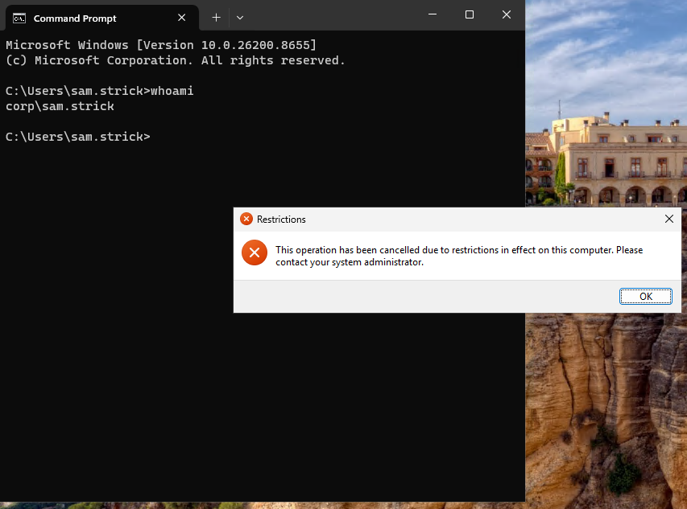
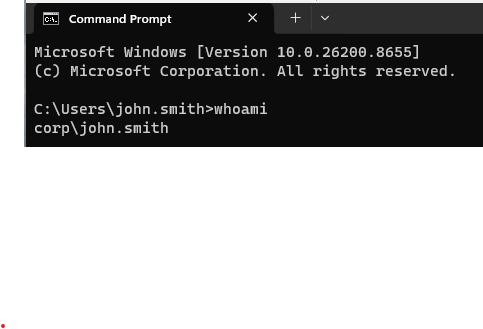
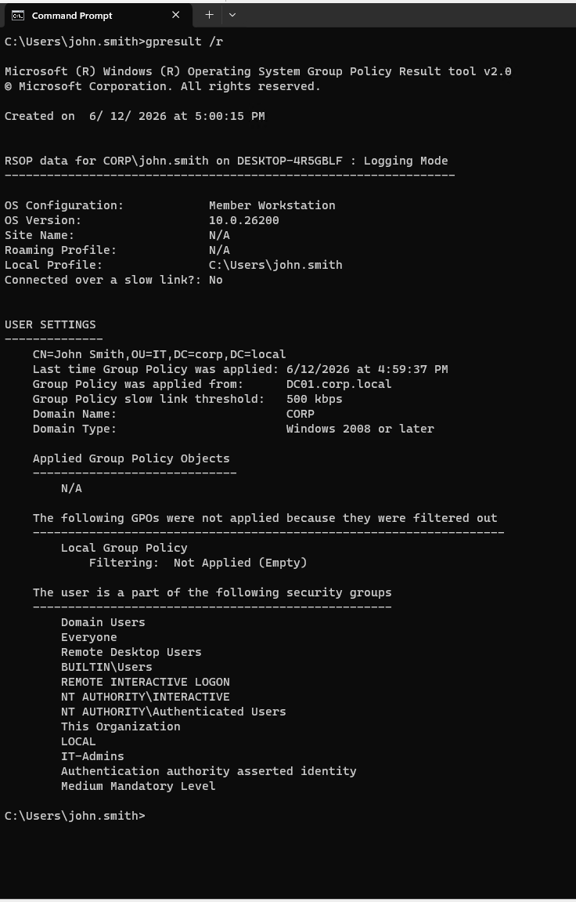

# Active Directory Home Lab

A fully functional Active Directory environment built on Hyper-V to simulate enterprise IT infrastructure.

## Environment

| Component | Details |
|---|---|
| Hypervisor | Microsoft Hyper-V |
| Domain Controller | Windows Server 2022 (DC01) |
| Client Machine | Windows 11 Enterprise (WIN11-CLIENT) |
| Domain | corp.local |
| Internal Network | AD-Lab (192.168.10.0/24) |

## What I Built

**Domain Controller (DC01)**
- Installed and configured Active Directory Domain Services on Windows Server 2022
- Promoted server to Domain Controller for the corp.local forest
- Configured DNS integrated with Active Directory
- Installed and authorized DHCP Server role with a scope of 192.168.10.100-200
- Created an internal virtual switch (AD-Lab) to isolate lab traffic

**Organizational Structure**
- Designed an OU hierarchy mirroring a real company: IT, HR, Finance, Sales
- Created domain user accounts across departments
- Created IT-Admins security group and assigned IT department users

**Group Policy**
- Created and linked a GPO (Desktop Lockdown) to the HR OU
- Configured policy to prohibit access to Control Panel and PC Settings for HR users
- Verified policy enforcement using gpresult /r on the client machine

**Windows 11 Client**
- Deployed Windows 11 Enterprise VM on Hyper-V
- Configured VM to receive IP automatically from DC01's DHCP scope
- Successfully domain joined to corp.local
- Verified domain login using domain user credentials (CORP\john.smith)
- Confirmed GPO application via gpresult /r

## Screenshots

### OU Structure and Users

### IT-Admins Group Membership

### GPO Linked to HR OU

### GPO Scope

### GPO Setting Enabled

### Domain Computer Registered in AD

### Domain User Login Verified

### GPO Applied on Client

## Skills Demonstrated

- Active Directory administration (users, groups, OUs)
- Group Policy creation, linking, and verification
- DHCP server configuration and scope management
- DNS integrated with Active Directory
- Windows Server 2022 role installation and configuration
- Domain join and client management
- Hyper-V virtual networking (internal switch, multiple NICs)
